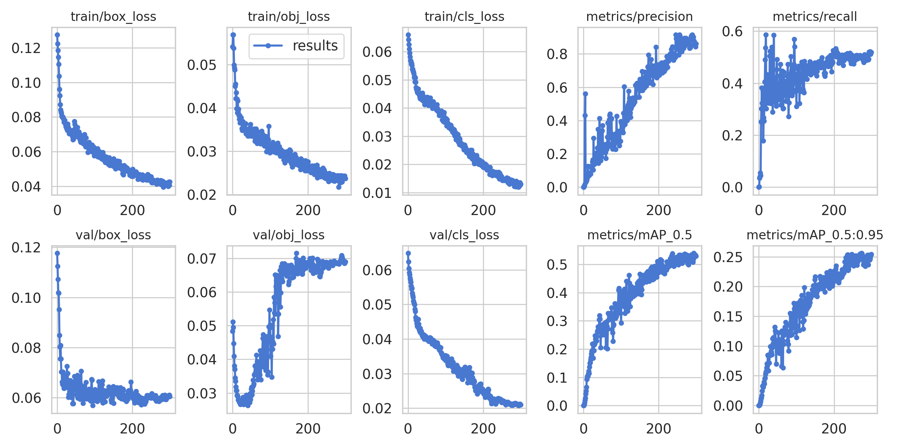

# Water meter reader
This dataset, collected by Roman Kucev from TrainingData.ru, contains 1244 images of hot and cold water meters as well as their readings and coordinates of the displays showing those readings. Each image contains exactly one water meter. The archive also includes the pictures of the results of segmentation with the masks and collages. Toloka was used for photo capturing, segmentation, and recognizing the readings.

The dataset is from [Toloka](https://toloka.ai/datasets?utm_source=google&utm_medium=cpc&utm_campaign=Search_Worldwide_eng_Desktop_B2B_Requesters-main_toloka%7C15435064960&utm_content=k50id%7Ckwd-341876450090%7Ccid%7C15435064960%7Caid%7C565705955254%7Cgid%7C130065033053%7Cpos%7C%7Csrc%7Cg_%7Cdvc%7Cc%7Creg%7C9062010%7Crin%7C%7C&utm_term=toloka&gclid=Cj0KCQiAweaNBhDEARIsAJ5hwbf0LX0iOaJtNn5bKPNOe2zVcG7XrkCQFuJSeUn_8nYwQSvVUEejFngaAkKTEALw_wcB)

# Objective
The goal is to build a water meter reader

# Dataset preparation
[Label Studio](https://labelstud.io/) was used for annotating the readings.

# Training
[Yolov5](https://github.com/ultralytics/yolov5) was used for object detection

I annotated around 400 images, but you could do with less provided you increase the epochs. Initially I only used 50 epochs which was inadequate as the image quality is poor. In the end, I used 300 epochs which took about 2 hours to train.
The mAP@0.5 was around 55%, and the overall accuracy on the validation set was around 65%.
[Colab](https://colab.research.google.com/) was used for training and inference.

This could be further improved by doing the following:
1) Add more annotated images
2) Include the rotation angle of the bounding boxes
3) Train for > 300 epochs

# Results

# App
I built an app using [Streamlit](https://docs.streamlit.io/library/api-reference)
You can access it [here](https://water-meter-reader.streamlit.app)

